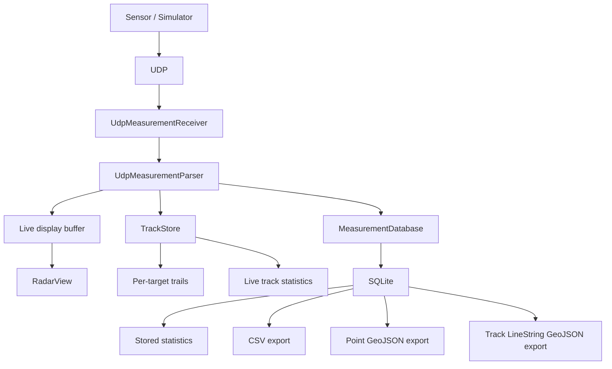

# GeoSensor Radar Viewer
[](https://github.com/wpop/geosensor-radar-viewer/actions/workflows/ci.yml)

GeoSensor Radar Viewer is a C++20 and Qt6 desktop application for radar-like sensor data. It ingests UDP measurements in real time, transforms them into local ENU and geographic coordinates, tracks multiple targets, persists live measurements in SQLite, and exports both measurements and tracks to CSV and GeoJSON.

## Screenshot


## Key Features

- Qt6 Widgets desktop UI
- CSV sample measurement loading
- UDP receiver on `127.0.0.1:5005`
- Python 3 sensor simulator with `static`, `moving`, and `multi` modes
- Legacy 4-field UDP packets and target-aware 5-field UDP packets
- Bounded live-point display buffer
- Multi-target `TrackStore` with short per-target trails
- Live track statistics in the UI
- SQLite persistence for live measurements
- Stored per-target statistics from SQLite
- Clear stored measurements action
- Range / azimuth / elevation to ENU and WGS84 coordinate transformation
- Optional PROJ integration for geographic conversion
- CSV measurement export
- Point GeoJSON measurement export
- Filtered measurement exports: all, tracked only, or selected `target_id`
- GeoJSON LineString track export
- Optional GDAL/OGR integration for GeoJSON output
- GitHub Actions CI
- Five CTest suites: coordinates, CSV loader, UDP parser, storage, and tracking

## Architecture

See also [`docs/architecture.md`](docs/architecture.md).



## Technology Stack

Core application:

- C++20
- Qt6 Widgets
- Qt6 Network
- SQLite3

Build and testing:

- CMake
- Ninja
- CTest
- GitHub Actions

Demo simulator:

- Python 3

Optional geospatial support:

- PROJ
- GDAL/OGR
- pkg-config for GDAL discovery

When PROJ is not available, coordinate transformation falls back to the built-in WGS84 approximation. When GDAL is not available, Point GeoJSON export uses the manual JSON writer and Track LineString export requires GDAL/OGR.

## Build

On Ubuntu 24.04, a practical setup is:

```bash
sudo apt install \
  cmake \
  ninja-build \
  g++ \
  qt6-base-dev \
  libsqlite3-dev \
  python3 \
  pkg-config \
  libproj-dev \
  libgdal-dev
```

`libproj-dev` and `libgdal-dev` are optional. The project still builds without them, but the runtime export and coordinate fallback behavior changes as described above.

Configure and build:

```bash
cmake -S . -B build -G Ninja
cmake --build build
```

## Run

```bash
./build/geosensor-radar-viewer
```

## Demo Workflow

Terminal 1:

```bash
./build/geosensor-radar-viewer
```

Use `Start UDP` in the UI if needed.

Terminal 2:

```bash
./scripts/simulator/udp_sensor_simulator.py \
  --mode multi \
  --interval 0.2 \
  --azimuth-step 5
```

In the UI, you should see multiple moving target IDs, short per-target trails, live statistics, a growing UDP packet count, and the SQLite row count increasing. Export flow:

- choose `All measurements`, `Tracked only`, or `Target ID`
- export measurements as CSV or Point GeoJSON
- export tracked targets as GeoJSON LineString features

## UDP Payload Formats

```text
range_m,azimuth_deg,elevation_deg,intensity
target_id,range_m,azimuth_deg,elevation_deg,intensity
```

The 4-field format is backward compatible. The 5-field format adds `target_id` and enables target-aware trails and stored per-target data.

## Storage and Export

Live measurements are stored in `data/geosensor_live_measurements.sqlite`.

Stored measurement rows include:

- nullable `target_id`
- `timestamp_ms`
- `range_m`
- `azimuth_deg`
- `elevation_deg`
- `intensity`

Legacy rows from 4-field packets keep `target_id = NULL`. The database migrates older schemas in place by adding missing columns.

Exports and stored statistics:

- filtered CSV export
- filtered Point GeoJSON export
- GeoJSON LineString track export
- stored per-target statistics grouped by `target_id`

## Tests

Run the CTest suites with:

```bash
ctest --test-dir build --output-on-failure
```

The repository currently registers five test executables:

- `geosensor_coordinate_tests`
- `geosensor_csv_tests`
- `geosensor_udp_parser_tests`
- `geosensor_storage_tests`
- `geosensor_tracking_tests`

GitHub Actions builds the project and runs this test suite in CI.

## Project Structure

```text
include/geosensor/
├── coordinates/
├── data/
├── io/
├── networking/
├── storage/
├── tracking/
└── ui/

src/
├── coordinates/
├── io/
├── networking/
├── storage/
├── tracking/
└── ui/

tests/
├── coordinates/
├── io/
├── storage/
└── tracking/

scripts/simulator/
docs/
```

## Project Status

The core portfolio and demo workflow is complete: the application demonstrates UDP ingestion, target tracking, geographic transformation, SQLite persistence, export paths, automated tests, and CI. It is intentionally focused on being a clear engineering demonstration rather than production radar-processing software.
