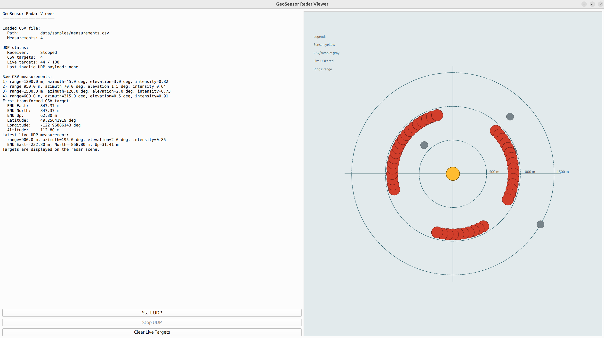

# GeoSensor Radar Viewer

GeoSensor Radar Viewer is a C++20 and Qt6 desktop application for visualizing georeferenced radar-like sensor measurements. It demonstrates a focused workflow for loading CSV data, transforming measurements into local ENU coordinates, and presenting the results in a radar-style view.

## Screenshot



## Current Features

- Qt6 Widgets desktop interface
- CSV loading for radar-style sensor measurements
- Range / azimuth / elevation to local ENU coordinate transformation
- Approximate ENU to WGS84 latitude / longitude conversion
- Radar-style 2D visualization with:
  - sensor center
  - range rings
  - range labels
  - detected targets
  - legend
- Unit tests for coordinate transformations
- Unit tests for CSV measurement loading

## Example CSV Format

```csv
range_m,azimuth_deg,elevation_deg,intensity
1200.0,45.0,3.0,0.82
950.0,70.0,1.5,0.64
1500.0,120.0,2.0,0.73
600.0,315.0,0.5,0.91
```

## Technology Stack

- C++20
- Qt6 Widgets
- CMake
- Ninja
- CTest

## Build Instructions

```bash
cmake -S . -B build -G Ninja
cmake --build build
```

## Run Instructions

```bash
./build/geosensor-radar-viewer
```

## UDP Sensor Simulator

The repository includes a small Python UDP simulator that sends one radar-style measurement per packet as CSV text:

```text
1200.0,45.0,3.0,0.82
```

Run it with the default destination `127.0.0.1:5005` and a `1.0` second interval:

```bash
./scripts/simulator/udp_sensor_simulator.py
```

Optional arguments:

- `--host` to change the destination host
- `--port` to change the destination UDP port
- `--interval` to change the delay between packets in seconds

## Test Instructions

The project uses simple C++ assert-based test executables registered with CTest.

```bash
ctest --test-dir build --output-on-failure
```

## Project Structure

```text
include/geosensor/
├── coordinates/
├── data/
├── io/
└── ui/

src/
├── coordinates/
├── io/
└── ui/

tests/
├── coordinates/
└── io/

data/samples/
docs/images/
scripts/simulator/
```

## Roadmap

- UDP sensor simulator
- Qt UDP receiver
- SQLite storage
- GDAL / PROJ GIS support
- GitHub Actions CI
