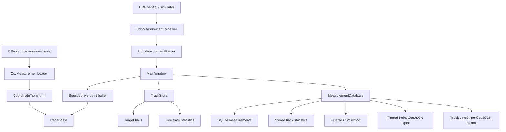

# Architecture

GeoSensor Radar Viewer is a small Qt6 desktop application with two main input paths: sample CSV measurements for reference visualization, and live UDP measurements for live display, optional target tracking, persistence, statistics, and export.

## Overview

The application is organized as a straightforward data flow:

The UI is centered in `MainWindow`, which orchestrates live measurements from UDP, updates the live display buffer, forwards target-aware points into `TrackStore`, and persists valid measurements in SQLite. `RadarView` renders the sample targets, live measurements, and per-target trails.

## High-Level Data Flow

CSV path:

1. `CsvMeasurementLoader` reads the sample CSV file used by the demo workflow.
2. `CoordinateTransform` converts each sample measurement into local and geographic coordinates.
3. `RadarView` displays the sample dataset as the reference visualization.

UDP path:

1. The UDP sensor or simulator sends radar-like packets to `127.0.0.1:5005`.
2. `UdpMeasurementReceiver` reads datagrams and forwards them to `UdpMeasurementParser`.
3. `UdpMeasurementParser` decodes either legacy 4-field packets or target-aware 5-field packets.
4. `MainWindow` orchestrates the live UI update, including the bounded live-point buffer.
5. If a `target_id` is present, `MainWindow` also updates `TrackStore` and its track statistics.
6. Valid live measurements are inserted into SQLite by `MeasurementDatabase`.
7. Stored measurements can be exported to CSV, Point GeoJSON, or LineString GeoJSON from SQLite.

## Module Responsibilities

- `CsvMeasurementLoader` reads the sample CSV file used by the demo workflow. It expects the header line followed by `range_m,azimuth_deg,elevation_deg,intensity` rows.
- `UdpMeasurementParser` accepts both legacy 4-field UDP payloads and target-aware 5-field payloads. When the first field parses as a target identifier, it is stored in the packet; otherwise the packet is treated as legacy data.
- `UdpMeasurementReceiver` binds a UDP socket on localhost port `5005`, parses incoming datagrams, and emits either a valid packet or an invalid-payload notification.
- `CoordinateTransform` converts sensor measurements into local ENU coordinates and then into geographic coordinates.
- `TrackStore` groups live target-aware points by `target_id` and keeps recent trail points for each active track.
- `MeasurementDatabase` stores valid live measurements in SQLite, computes stored statistics, and exports rows to CSV and GeoJSON.
- `MainWindow` wires the receiver, parser, storage layer, tracking model, and tables together. It also owns the export actions and the clear actions.
- `RadarView` draws the sample dataset, live points, and short trails for tracked targets.
- Shared data types include `SensorMeasurement`, `SensorOrigin`, and `TargetPosition`. These value types are used across parsing, coordinate transformation, tracking, visualization, and storage where applicable.

## Coordinate Pipeline

`CoordinateTransform` performs the measurement conversion in two stages:

- range, azimuth, and elevation are converted into local ENU coordinates
- ENU coordinates are converted into geographic coordinates relative to the configured sensor origin

The azimuth convention used by the code is:

- `0` degrees = north
- `90` degrees = east
- `180` degrees = south
- `270` degrees = west

The elevation convention is:

- `0` degrees = horizontal
- positive values = upward

When `GEOSENSOR_HAVE_PROJ` is defined, `enuToGeographic()` first tries a PROJ-based EPSG:4978 -> EPSG:4979 conversion. If PROJ is unavailable, or if the PROJ path fails at runtime, the code falls back to the built-in local WGS84 approximation.

## Tracking Model

Tracking is keyed by `target_id`.

- `TrackStore` keeps one track history per target ID.
- `MainWindow` only feeds packets with a `target_id` into `TrackStore`.
- Legacy 4-field packets still update the live buffer and SQLite storage, but they do not create or extend a track.
- The live statistics table is derived from the in-memory track histories.
- The `Clear Live Targets` action clears the live buffer and the in-memory track histories without affecting SQLite.

The track trails shown in `RadarView` are intentionally short and bounded. The goal is to show recent motion clearly rather than retain an unlimited history.

## Persistence

SQLite stores live measurements in `data/geosensor_live_measurements.sqlite`.

The `measurements` table stores:

- `id`
- nullable `target_id`
- `timestamp_ms`
- `range_m`
- `azimuth_deg`
- `elevation_deg`
- `intensity`

`MeasurementDatabase` opens or creates the database file, creates the table when needed, and migrates older schemas in place by adding missing columns. It also provides:

- `measurementCount()`
- `clearMeasurements()`
- `trackStatistics()`
- filtered CSV export
- filtered Point GeoJSON export
- LineString track export

Stored track statistics are computed directly from the measurements table using SQL aggregation grouped by `target_id`.

## Export Paths

The export paths are intentionally separate:

- CSV export writes the stored measurements as plain comma-separated rows.
- Point GeoJSON export writes one feature per stored measurement.
- Track GeoJSON export writes one LineString feature per non-null target ID.

Exports support a small filter model for all measurements, tracked-only measurements, or one selected `target_id`. The Point GeoJSON exporter uses GDAL/OGR when available and falls back to the manual JSON writer when GDAL is not present. The track LineString exporter requires GDAL/OGR.

All geographic export paths use the configured sensor origin through `CoordinateTransform`.

## Optional Dependencies and Compile-Time Paths

### PROJ

When PROJ is available, `CMakeLists.txt` defines `GEOSENSOR_HAVE_PROJ`. This enables the PROJ-based geographic conversion path in `CoordinateTransform`. When PROJ is not available, the application still builds and uses the built-in approximation.

### GDAL / OGR

When GDAL is available, `CMakeLists.txt` defines `GEOSENSOR_HAVE_GDAL`. This enables the GDAL/OGR GeoJSON writer for point export and track export. When GDAL is not available:

- Point GeoJSON export uses the manual fallback writer
- Track LineString export remains compiled, but returns `false`

## Testing Boundaries

The tests are split along module boundaries:

- coordinate tests cover the ENU and geographic conversion logic
- CSV loader tests cover sample-file parsing
- UDP parser tests cover legacy and target-aware packet formats
- storage tests cover SQLite open, migration, insert, aggregation, and export behavior
- tracking tests cover the in-memory `TrackStore`

GitHub Actions builds the project and runs the full CTest suite in CI.

## Design Scope

This is a focused portfolio and demo application. The architecture intentionally avoids unnecessary large abstractions while still demonstrating modular C++ design, UDP ingestion, geospatial transformation, tracking, SQLite persistence, export, testing, and CI. It is not presented as production radar-processing software.
